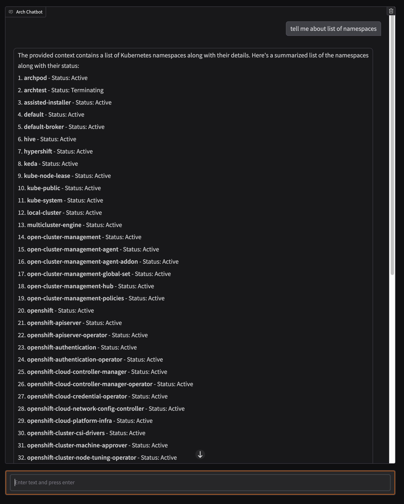
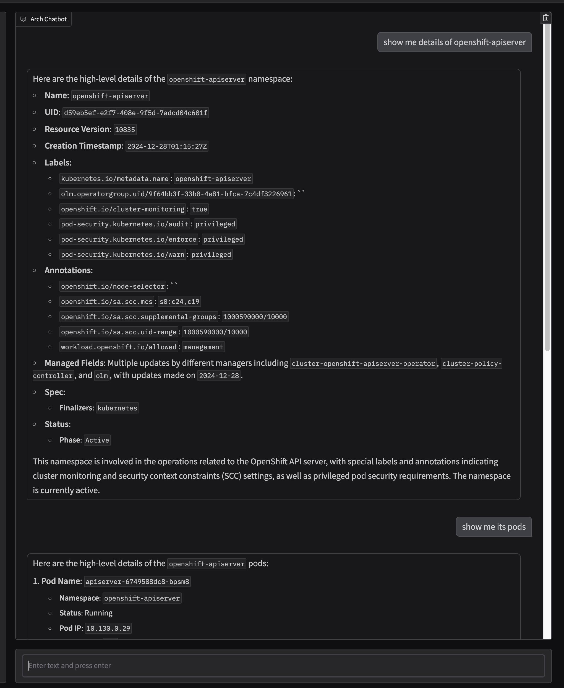
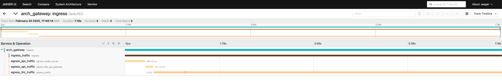

# Kubernetes API Demo

This demo shows how you can use a publicly hosted REST API and interact with it using the Arch Gateway.

## Summary

In this demo, you will learn how to set up and run a model server, Arch Gateway, and a Docker container for the UI. You will also learn how to tail access logs for debugging purposes. The demo includes examples of getting namespace details and retrieving pod information from a Kubernetes cluster.

# How to run this demo.

Before starting make sure you have completed the pre-requisites [here](https://github.com/katanemo/archgw?tab=readme-ov-file#prerequisites)

In separate window start 1) model server, 2) arch gateway 3) docker container for UI and for debugging 4) tail access logs

1. start model server
   ```
   archgw up --service model_server --foreground
   ```

1. start arch gateway
   ```
   archgw up --service archgw --foreground
   ```

1. start docker container for ui
   ```
   docker compose up
   ```
1. tail access logs
   ```
   tail -F ~/archgw_logs/access_*
   ```

Here is a sample screenshot of the demo in action,


- show usage of get namespace details and get pods


# Observability

You can see access logs to see details of outbound API calls through arch gateway. You can also see request details using supplied jaeger UI. Following is a screenshot showing one request served through arch gateway,


